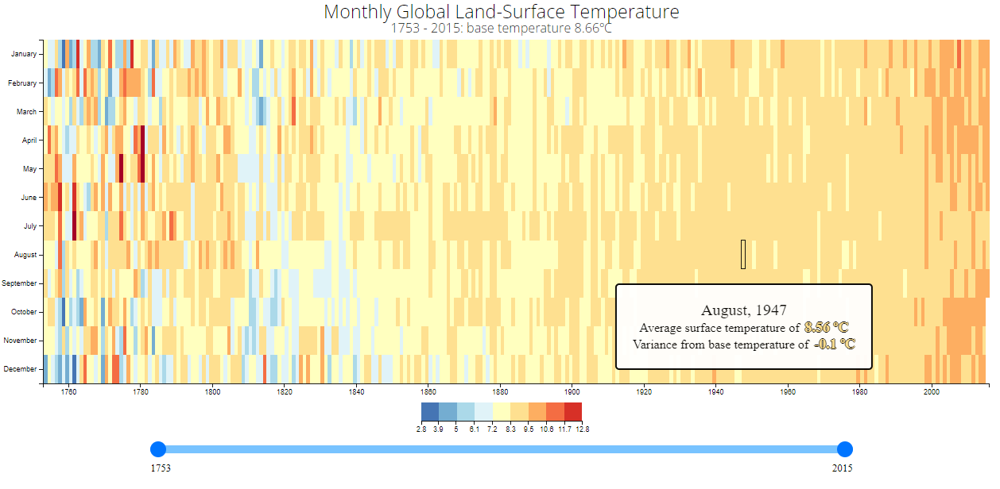
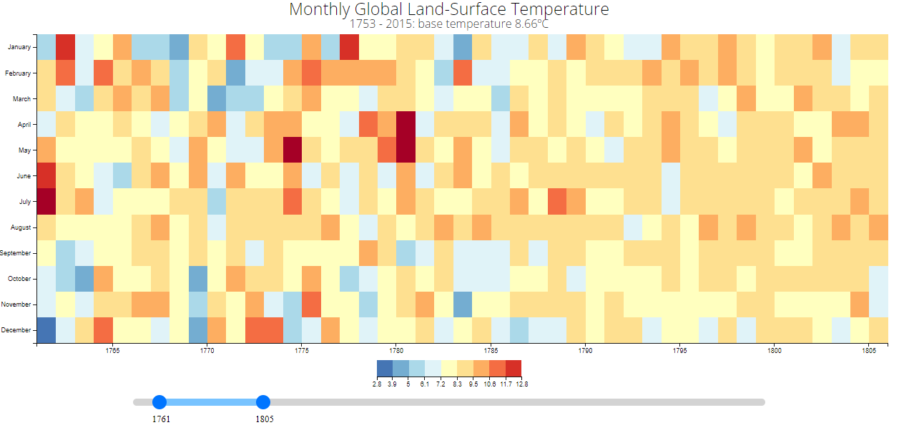

# Visualize Data with a Heat Map

- This D3 graph allows you to visualize data with a heat map.

Technologies used: Javascript, D3

# Live Version

# Requirements

- My heat map should have a title with a corresponding id="title".
- My heat map should have a description with a corresponding id="description".
- My heat map should have an x-axis with a corresponding id="x-axis".
- My heat map should have a y-axis with a corresponding id="y-axis".
- My heat map should have rect elements with a class="cell" that represent the data.
- There should be at least 4 different fill colors used for the cells.
- Each cell will have the properties data-month, data-year, data-temp containing their corresponding month, year, and temperature values.
- The data-month, data-year of each cell should be within the range of the data.
- My heat map should have cells that align with the corresponding month on the y-axis.
- My heat map should have cells that align with the corresponding year on the x-axis.
- My heat map should have multiple tick labels on the y-axis with the full month name.
- My heat map should have multiple tick labels on the x-axis with the years between 1754 and 2015.
- My heat map should have a legend with a corresponding id="legend".
- My legend should contain rect elements.
- The rect elements in the legend should use at least 4 different fill colors.
- I can mouse over an area and see a tooltip with a corresponding id="tooltip" which displays more information about the area.
- My tooltip should have a data-year property that corresponds to the data-year of the active area.